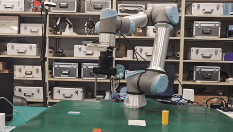
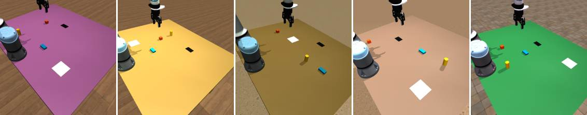

<div align="center">

# vla-ur5e-sim2real

面向 UR5e 桌面关系重排任务的 MuJoCo 仿真、Sim2Real、RTC 异步推理 VLA 工程


识别物体、理解方位，让 VLA 从仿真训练走向 UR5e 真机异步控制。

[项目配置](#项目配置) | [项目介绍](#项目介绍) | [数据采集](#数据采集) | [领域随机化](#领域随机化) | [数据处理与回放](#数据处理与回放) | [训练](#训练) | [实验对比数据](evaluation/results/README.md) | [真机部署](#真机部署) | [许可证](#许可证)<br>
[仿真 GIF](#仿真-gif) | [真机推理 GIF](#真机推理-gif)

</div>

## 项目配置

| 部分 | 用途 |
| --- | --- |
| 客户端 | MuJoCo 仿真、数据采集、数据回放、数据转换与 RTC 请求、SharedMemoryRingBuffer 时间对齐与 RTDE 分层控制 |
| 服务端 | OpenPI 训练、归一化统计与 RTC Policy Server |

### 客户端安装

初始化子模块：

```bash
git submodule update --init --recursive
conda env create -f environment-client.yml
conda activate vla-ur5e-client
```

OpenPI 官方建议机器人端只安装轻量的 `openpi-client`。

```bash
pip install --no-deps -e thirdparty/openpi/packages/openpi-client
```

### 服务端安装

服务端使用 OpenPI 官方推荐的 `uv` 环境，负责训练和启动 policy server。

```bash
cd thirdparty/openpi
GIT_LFS_SKIP_SMUDGE=1 uv sync
GIT_LFS_SKIP_SMUDGE=1 uv pip install -e .
```

安装完成后，按训练章节将 `changes` 目录中的文件替换到 OpenPI 中。

## 项目介绍

此项目首先面向 UR5e 真机上的语言条件推理与闭环控制：模型在 MuJoCo 中完成数据生成和训练，再通过 Sim2Real 部署到真实机器人，并由 RTC 异步推理与 RTDE 分层控制持续执行动作。目标是让机器人不只是“看见”物体，还能把语言中的空间关系稳定地落到真机操作上。

这个项目关注的是 VLA 机器人操作中非常基础、也非常关键的一环：物体识别与方位理解。任务中包含不同颜色、形状和尺寸的物体，以及白色方形纸片、黑色矩形纸片等空间参照物。模型需要先判断“红色方块”“黄色圆柱”“青色长方体”分别在哪里，再理解 `left`、`right`、`up`、`down`、`center` 这类相对方位，最终完成由语言驱动的桌面关系重排。

相比单步抓取任务，这里的指令通常由两个连续子任务组成，例如先把一个物体放到纸片中心，再把另一个物体放到目标物体下方。这样的设计可以更直接地检验模型是否真正理解了物体身份、参考对象和空间关系，而不是只记住固定轨迹。因此，此项目既可以作为 UR5e 仿真数据采集工具，也可以作为训练和验证空间语言理解型 VLA policy 的小型基准工程。

| 能力 | 内容 |
| --- | --- |
| 物体识别 | 红色方块、黄色圆柱、青色长方体、白色方形纸片、黑色矩形纸片 |
| 方位理解 | `left`、`right`、`up`、`down`、`center` 等空间关系 |

### 任务示意图

<p align="center">
  
</p>

### 仿真 GIF

<table>
  <tr>
    <td align="center" width="50%">
      <b>中文</b><br>
      将红色方块移动到黑色矩形纸片中心，然后将黄色圆柱放到青色长方体下方。<br><br>
      <b>English</b><br>
      Move the red cube at the center of the black rectangular paper, then put the yellow cylinder under the cyan cuboid.<br><br>
      
    </td>
    <td align="center" width="50%">
      <b>中文</b><br>
      将青色长方体移动到白色方形纸片右侧，然后将黄色圆柱移动到红色方块上方。<br><br>
      <b>English</b><br>
      Transfer the cyan cuboid on the right side of the white square paper, then carry the yellow cylinder over the red cube.<br><br>
      
    </td>
  </tr>
</table>

### 真机推理 GIF

<p align="center">
  
  <br>
  <sub>指令：Transfer the red cube below the cyan cuboid, then carry the yellow cylinder in the centre of the black rectangular paper.</sub>
</p>

---

## 数据采集

数据采集入口是 `dataset_record/record.py`，默认加载 `description/desktop_scene.xml`，并保存为 LeRobot 格式数据集。

### 领域随机化

<p align="center">
  
  <br>
  <sub>开启全部领域随机化后的 5 组前视相机观测</sub>
</p>

#### 本项目实验结果

领域随机化的目标不是单纯让仿真画面更接近真实画面，而是降低模型对固定相机、背景、光照和物体外观组合的依赖。本项目在完全相同的 120 个两阶段任务上评测 5 种训练配置，共运行 **600 个 episode**。成功率仅根据 episode 结束时的最终位置关系判断，**3 cm** 为主标准，**5 cm** 用于分析落点容忍度。

| 训练配置 | Stage 1 @3 cm | Stage 2 @3 cm | **双阶段 @3 cm** | **双阶段 @5 cm** |
| --- | ---: | ---: | ---: | ---: |
| No RD | 59.2% | 39.2% | 25.8% | 40.0% |
| Spatial RD · episode-wise | 76.7% | 65.0% | 51.7% | 60.8% |
| Spatial RD · episode + frame-wise | 76.7% | 58.3% | 48.3% | 60.0% |
| **Appearance RD** | **78.3%** | 69.2% | **57.5%** | 63.3% |
| **All RD** | **78.3%** | **71.7%** | **57.5%** | **65.0%** |

四种 RD 配置的双阶段成功率均显著高于 No RD。主阈值下，`appearance_rd` 与 `all_rd` 从 **25.8% 提升到 57.5%（+31.7 个百分点）**；逐 case 配对检验均达到 `p < 0.001`。`all_rd` 在 5 cm 下达到最高的 **65.0%**，但它与 `appearance_rd` 的差异尚不显著，因此当前结果支持“**RD 有效**”，尚不能证明某一种 RD 训练配置绝对最优。

除了训练配置消融，评测还将相机、桌面颜色、光照和物体颜色组合分别从训练分布内（ID）扩展到分布外（OOD）。下表汇总五个配置的双阶段成功率，每类包含 `50 ID + 50 OOD` 个模型—case 观测：

| 单因素变化 | **双阶段 @3 cm：ID → OOD** | 变化 | 配对 p 值 | 结果判断 |
| --- | ---: | ---: | ---: | --- |
| 相机视角 | 48.0% → 60.0% | +12.0 个百分点 | 0.180 | 未观察到显著退化 |
| 桌面颜色 | 50.0% → 64.0% | +14.0 个百分点 | 0.119 | 未观察到显著退化 |
| 光照 | 60.0% → 58.0% | −2.0 个百分点 | 1.000 | 基本持平 |
| **物体颜色—形状组合** | **34.0% → 4.0%** | **−30.0 个百分点** | **< 0.001** | **显著退化** |

相机、桌面颜色和光照在当前轻度 OOD 范围内没有出现可靠下降；其中的正向差值也不应解释为 OOD 能提升模型，因为单配置、单因素的样本量仍然较小。最明确的失败模式来自**未见过的颜色—形状组合**：尽管颜色和物体类别分别出现过，模型仍难以重新绑定二者。链式任务也是另一项主要瓶颈——最佳双阶段成功率只有 **45.0%（3 cm）**，明显低于独立任务的 **78.3%**。

> [!TIP]
> [查看完整实验对比数据：任务组成、链式设计、3/5 cm 矩阵、ID/OOD 分析与详细结论 →](evaluation/results/README.md)

### 生成任务描述

用于批量生成中英文任务描述和自动化采集所需的命令序列，输出到 `dataset_record/info/task1/task_descriptions.json`。自动化采集时，`record.py` 会通过 `--task-descriptions` 读取该文件。

```bash
python dataset_record/task_description_generate.py
```

### 自动化采集

下面的命令会开启 episode 级空间随机化、frame 级空间随机化和外观随机化：

```bash
python dataset_record/record.py \
  --teleop autoteleop \
  --task-descriptions dataset_record/info/task1/task_descriptions.json \
  --num-episodes 10 \
  --spatial-episode-rd \
  --spatial-frame-rd \
  --appearance-rd \
  --headless \
  --overwrite
```

---

## 数据处理与回放

### 数据集转换

将采集得到的 LeRobot v3.0 数据集转换为 OpenPI 兼容的 LeRobot v2.1 布局。

```bash
python scripts/convert_lerobot_v30_to_v21.py \
  --root dataset_record/data/task1/bucket1_zero_completed1 \
  --output-root dataset_record/data/task1/bucket1_zero_completed1_v21 \
  --overwrite
```

### 数据回放

在 MuJoCo 中回放指定 episode，便于检查采集轨迹、图像观测和动作是否正常。

```bash
python dataset_record/replay.py \
  --root dataset_record/data/task1/bucket1_zero_completed1 \
  --episode 0
```

---

## 训练

训练在 `thirdparty/openpi` 中完成。先用 `changes` 目录下的文件替换 OpenPI 中对应文件。

### 替换 OpenPI 文件

```bash
cp changes/config.py thirdparty/openpi/src/openpi/training/config.py
cp changes/data_loader.py thirdparty/openpi/src/openpi/training/data_loader.py
cp changes/serve_policy.py thirdparty/openpi/scripts/serve_policy.py
cp changes/ur5e_policy.py thirdparty/openpi/src/openpi/policies/ur5e_policy.py
```

### 训练流程

进入 OpenPI：

```bash
cd thirdparty/openpi
```

指定训练数据集并计算归一化统计，注意这里使用lerobot_dataset v21格式数据集：

```bash
uv run scripts/compute_norm_stats.py \
  --config-name pi05_ur5e_lora
```

启动 PI0.5 LoRA 微调：

```bash
XLA_PYTHON_CLIENT_MEM_FRACTION=0.9 \
uv run scripts/train.py pi05_ur5e_lora \
  --exp-name=ur5e_lora \
  --save-interval=50000 \
  --overwrite
```

训练完成后 checkpoint 默认保存在：

```text
thirdparty/openpi/checkpoints/pi05_ur5e_lora/ur5e_lora/<step>/
```

---

## 真机部署

真机端将双 RealSense、UR5e 与夹爪状态按时间戳组装为 VLA observation；OpenPI 在服务端异步生成 action chunk，RTC 在 30 Hz 控制时间线上衔接动作，RTDE 控制层再将末端目标展开为 125 Hz 的机器人指令。

### SharedMemoryRingBuffer：感知与时间对齐

双 RealSense、机器人状态和夹爪状态分别由独立数据源写入共享内存环形缓冲区，并为每条数据记录主机接收时间。发起推理时，以 `t_anchor` 为统一时间锚点，从每个 RingBuffer 中选择“不晚于锚点的最新样本”，避免把未来状态和过去图像错误地拼成同一帧观测。


### RTDE + IK + ServoJ：分层闭环控制

RTC 输出的 30 Hz action 先积分为末端位姿目标，再插值到 125 Hz。每个插值目标使用上一合法关节状态作为 IK 初值，并通过 FK 回代误差与关节连续性检查；首次失败时将插值步长缩小为原来的 `3/4` 后重试，仍不合法则取消当前 action 的剩余插值并保持上一合法关节目标。

### RTC：异步推理与动作块衔接

RTC 将 OpenPI 推理放到后台线程中，控制主线程继续消费当前动作队列。队列剩余不超过阈值且没有未完成请求时，客户端采集新 observation，并把上一动作块、预测延迟和 execution horizon 一并发送；新 chunk 返回后跳过推理期间已经消耗的前缀，再接管剩余控制时间线。

### 部署参数

启动前按实际设备重新设置以下参数：

| 参数 | 代码位置 | 设置内容 |
| --- | --- | --- |
| Policy Server 地址 | `inference/client.py`：`DEFAULT_HOST`、`DEFAULT_PORT` | 服务端局域网 IP 与 `8088` 端口 |
| UR5e 地址 | `inference/realworld/shared_memory_state_collector.py`：`REALWORLD_ROBOT_IP` | 真机控制柜 IP |
| RealSense 序列号 | `inference/realworld/real_inference.py`：`cameras` | 前视与腕部相机序列号 |
| 夹爪串口 | `inference/realworld/shared_memory_state_collector.py`：`SERIAL_GRIPPER_PORT` | 例如 `/dev/ttyUSB0` |
| 任务指令 | `inference/realworld/shared_memory_state_collector.py`：`REALWORLD_PROMPT` | 当前真机任务的英文描述 |

### 启动 RTC 服务端

```bash
cd thirdparty/openpi

uv run scripts/serve_policy.py policy:checkpoint \
  --policy.config=pi05_ur5e_lora \
  --policy.dir=checkpoints/pi05_ur5e_lora/ur5e_lora/<step> \
  --port=8088 \
  --rtc
```

### 启动真机客户端

确认 UR5e 工作区内无人、急停可用且设备参数已经核对，再启动真机控制：

```bash
python inference/realworld/real_inference.py
```

按 `Ctrl+C` 停止 rollout。运行日志、观测快照和动作记录保存在 `inference/realworld/logs/<timestamp>/`。

---

## 许可证

本项目采用 [Apache License 2.0](LICENSE)。仓库中的第三方依赖和 Git submodule 继续遵循各自的许可证。
